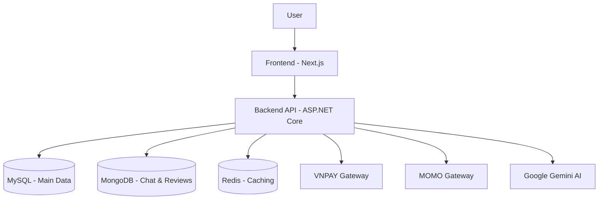

<div align="center">
  
</div>

<h1 align="center">
  📽 CINEMA MANAGEMENT SYSTEM (CMS)
</h1> 

<h3 align="center">✨ A cinema management system with real-time booking and online payment integration ✨</h3>

<p align="center">
  A full-stack cinema management system that supports real-time seat reservation, secure online payment integration, and efficient theater operations. The platform covers end-to-end management of movies,showtimes, bookings, and customer interactions.
</p>

<div align="center">
  
  [](https://github.com/thanhnhat23/PBL3_Cinema-Management)
  [](https://opensource.org/licenses/MIT)
  [](https://vnpay.vn)
  [](https://www.momo.vn/)
  
</div>

WEBSITE DEMO: https://milkywayyy.me

---

## 📷 Preview

- *Modern ticket booking interface with Glassmorphism effects.*

#### 💻 DESKTOP
<div align="center"> 
  
</div>

#### 📱 MOBILE
<div align="center"> 
  
</div>

---

## 🚀 Key Features
* 🌐 **Multi-Language Support**: Fully localized user interface (English & Vietnamese) integrated client-side using i18next middleware.

* 💺 **Real-Time Seat Reservation**:Active lock state (5-min TTL) synchronized across all buyers through WebSockets.

* 💳 **Dual Payment Gateways**: Seamless checkout supporting both VNPAY and MoMo with IPN endpoints.

* 🤖 **AI Chatbot Assistant**: Integrated Google Gemini LLM for intelligent answers, movie lookups, and scheduling recommendations.

* 🎫 **Coupon & Voucher Engine**: Fully-managed discount coupon engine supporting percentage or flat-rate deductions.
  
* 🍿 **Snack & Retail Inventory**: Dynamic management of snack orders and ingredient/product stocks updated automatically on checkout.
  
* 📧 **Email Notifications**: Automated, professionally-styled HTML receipts sent to customers upon ticket confirmation via Resend.
  
* 🔄 **Automated TMDB Sync**: Background worker automatically updates movie metadata, cast members, and trailers from The Movie Database (TMDB).

---

## 🧠 Technical Highlights
* ⚡ **Scalable WebSockets**: The SignalR real-time messaging layer is configured with a Redis Backplane to support horizontal scaling across multiple application nodes under heavy concurrency load.
  
* 🔄 **Atomic Resilient Seat Locking**: Uses Redis transaction routines and Lua script evaluations to atomically clear locks on socket disconnects (OnDisconnectedAsync), but prevents lock removals if seats have been verified as Pending payment in MySQL.
  
* 🗄️ **Polyglot Persistence (Multi-DB Architecture)**:
  
  * **MySQL (ACID relational database)**: Preserves transactional ticket orders, invoices, and user states.
    
  * **MongoDB (Document database)**: Handles chatbot logs and movie reviews.
    
  * **Redis (In-memory storage)**: Manages distributed locks, token caching, and prompt context indexes.
    
* 🏗️ **Modular Clean Architecture**: Standard separation of concerns (Controllers, Services, Data models, Infrastructure) ensuring payment gateway providers or background workers can be replaced or updated modularly.
  
* 🐳 **Cloud-Ready DevOps Pipeline**: Multi-stage Docker builds orchestrate the frontend, backend, database servers, and caches. Deployment scripts (docker.sh and docker.ps1) handle setup and boot dependencies automatically.
  
---

## 🛠 Tech Stack

### Frontend
<p align="left">
  <a href="https://skillicons.dev">
    
  </a>
</p>

### Backend & Infrastructure
<p align="left">
  <a href="https://skillicons.dev">
    
  </a>
</p>

*   **Other technologies:** SignalR (Real-time), Cloudinary (Media storage).

---

## 🏗 System architecture
The project is designed using a **Clean Architecture** model combined with **Monolith** architecture (which tends to separate services) to ensure scalability and ease of maintenance.



---

## 🚀 Quick installation guide

### 1. Clone project
```bash
git clone https://github.com/thanhnhat23/PBL3_Cinema-Management.git
```

### 2. Cấu hình Environment
Create a file named `appsettings.json` in the `server/CinemaAPI` directory and fill in the following information:
*   ConnectionStrings (MySQL & MongoDB)
*   VNPAY Config (TmnCode, HashSecret)
*   API Keys (Gemini, TMDB, Cloudinary)

### 3. Run the application
**Backend:**
```bash
cd server/CinemaAPI
dotnet restore
dotnet run
```
**Frontend:**
```bash
cd client
npm install
npm run dev
```

---

## 👥 Implementation team
This project was carried out by the **PBL3 - Cinema Management** student group:
*   **Lương Thanh Nhật (ルオン・タイン・ニャット):** Leader, Frontend Developer (UI/UX, State Management, Real-time Seat Map), Backend Developer
*   **Nguyễn Thị Nghĩa (グエン・ティ・ギア):** Backend Developer (API Design, Database, VNPAY Integration), Database design and optimization.

---
*Thank you for your interest in our project! If you found it helpful, please give us a ⭐!*
