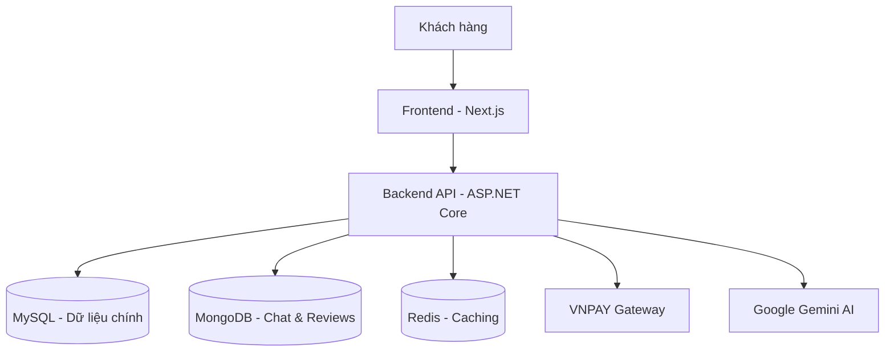

# 🎬 CINEMA MANAGEMENT SYSTEM (PBL3)

[](https://github.com/thanhnhat23/PBL3_Cinema-Management)
[](https://opensource.org/licenses/MIT)
[](https://vnpay.vn)
[](https://dotnet.microsoft.com/en-us/apps/aspnet)

**Nền tảng quản lý rạp chiếu phim tối ưu, hỗ trợ đặt vé thời gian thực và tích hợp thanh toán hiện đại.** Dự án được xây dựng nhằm giải quyết bài toán vận hành rạp phim từ khâu quản lý phim, suất chiếu đến trải nghiệm đặt vé của khách hàng.

[🚀 Demo Trực Tuyến](https://milkywayyy.me)

---

## 📷 Preview / Demo
\


*Giao diện đặt vé hiện đại với hiệu ứng Glassmorphism và sơ đồ ghế ngồi thời gian thực.*

---

## ✨ Tính năng nổi bật
*   **💳 Thanh toán VNPAY:** Tích hợp cổng thanh toán VNPAY phiên bản 2.1.0, hỗ trợ quét mã QR và thẻ nội địa an toàn, nhanh chóng.
*   **💺 Đặt vé thời gian thực:** Sơ đồ ghế ngồi cập nhật trạng thái tức thì khi có người đang chọn, tránh tình trạng trùng lặp.
*   **🤖 Chatbot AI (Gemini):** Trợ lý ảo hỗ trợ tìm kiếm phim, gợi ý suất chiếu và giải đáp thắc mắc khách hàng 24/7.
*   **🔄 Đồng bộ TMDB:** Tự động lấy thông tin phim, trailer, đánh giá từ hệ thống dữ liệu điện ảnh thế giới (The Movie Database).
*   **📊 Admin Dashboard:** Hệ thống quản lý toàn diện: doanh thu, lịch chiếu, nhân viên, và kho hàng (Snack/Combo).

---

## 🛠 Tech Stack

### Frontend
<p align="left">
  <a href="https://skillicons.dev">
    
  </a>
</p>

### Backend & Infrastructure
<p align="left">
  <a href="https://skillicons.dev">
    
  </a>
</p>

*   **Công nghệ khác:** SignalR (Real-time), Cloudinary (Media storage).

---

## 🏗 Kiến trúc hệ thống
Dự án được thiết kế theo mô hình **Clean Architecture** kết hợp với kiến trúc **Monolith** (có xu hướng tách Service) để đảm bảo tính mở rộng và dễ bảo trì.



---

## 🚀 Hướng dẫn cài đặt nhanh

### 1. Clone dự án
```bash
git clone https://github.com/thanhnhat23/PBL3_Cinema-Management.git
```

### 2. Cấu hình Environment
Tạo file `appsettings.json` trong thư mục `server/CinemaAPI` và điền thông tin:
*   ConnectionStrings (MySQL & MongoDB)
*   VNPAY Config (TmnCode, HashSecret)
*   API Keys (Gemini, TMDB, Cloudinary)

### 3. Chạy ứng dụng
**Backend:**
```bash
cd server/CinemaAPI
dotnet restore
dotnet run
```
**Frontend:**
```bash
cd client
npm install
npm run dev
```

---

## 👥 Đội ngũ thực hiện
Dự án được thực hiện bởi nhóm sinh viên **PBL3 - Cinema Management**:
*   **Lương Thanh Nhật:** Trưởng nhóm, Frontend Developer (UI/UX, State Management, Real-time Seat Map), Backend Developer
*   **Nguyễn Thị Nghĩa:** Backend Developer (API Design, Database, VNPAY Integration).  

---
*Cảm ơn bạn đã quan tâm đến dự án của chúng tôi! Nếu thấy hữu ích, hãy tặng chúng tôi 1 ⭐ nhé!*
